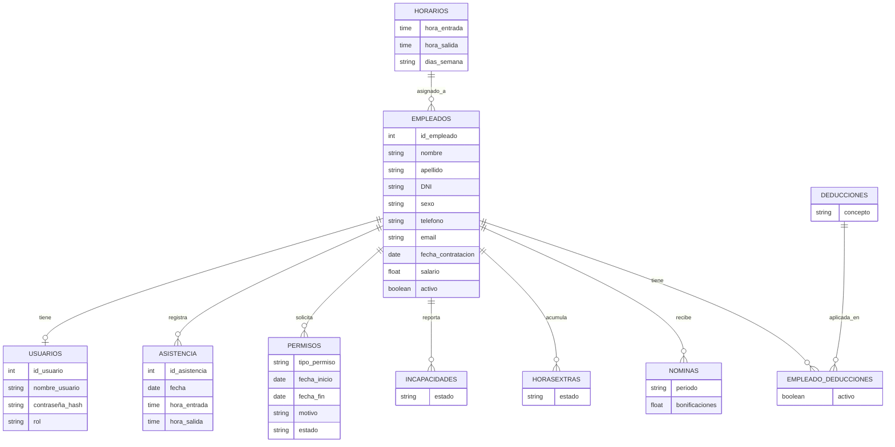

# Backend de Gestión de Personal


API REST para gestión de personal y recursos humanos: empleados, asistencia, permisos, incapacidades, horas extra, nóminas y deducciones. La misma API es consumida tanto por una **aplicación móvil** como por una **aplicación web**, lo que exigió un diseño desacoplado del cliente y con CORS habilitado desde el inicio.

## Tabla de contenidos

- [Descripción general](#descripción-general)
- [Stack tecnológico](#stack-tecnológico)
- [Modelo de datos](#modelo-de-datos)
- [Estructura del proyecto](#estructura-del-proyecto)
- [Instalación](#instalación)
- [Configuración de base de datos](#configuración-de-base-de-datos)
- [Autenticación](#autenticación)
- [Endpoints de la API](#endpoints-de-la-api)
- [Manejo de errores](#manejo-de-errores)
- [Seguridad](#seguridad)


---

## Descripción general

La API soporta una operación completa de RRHH y administración de personal:

- Registro y consulta de empleados
- Horarios laborales
- Registro de entradas y salidas de asistencia
- Permisos, incapacidades y horas extra, cada uno con **flujo de aprobación** (`aprobar` / `rechazar`), no solo CRUD simple
- Generación y consulta de nóminas, incluyendo carga por lote (`/nominas/batch`)
- Deducciones y asignaciones por empleado
- Autenticación con JWT para proteger rutas sensibles

Al ser consumida por dos clientes distintos (móvil y web) sobre la misma base de datos y lógica de negocio, la API está diseñada para ser agnóstica del frontend: toda la lógica de aprobación, cálculo y validación vive en el backend, no duplicada en cada cliente.

## Stack tecnológico

- **Node.js** + **Express** — servidor y enrutamiento
- **Sequelize ORM** sobre **MySQL** — modelado y acceso a datos
- **JWT** — autenticación por token en rutas protegidas
- **dotenv** — variables de entorno para credenciales y configuración
- **CORS** — habilitado para servir a los clientes móvil y web por igual

## Modelo de datos



## Estructura del proyecto

```text
backend_db2/
├── config/
│   ├── config.js
│   └── config.json
├── models/
│   ├── asistencia.js
│   ├── deducciones.js
│   ├── empleado_deducciones.js
│   ├── empleados.js
│   ├── horarios.js
│   ├── horasextras.js
│   ├── incapacidades.js
│   ├── index.js
│   ├── init-models.js
│   ├── nominas.js
│   ├── permisos.js
│   └── usuarios.js
├── src/
│   ├── controllers/
│   │   ├── asistenciaController.js
│   │   ├── DeduccionController.js
│   │   ├── EmpleadoController.js
│   │   ├── horarioController.js
│   │   ├── HorasExtrasController.js
│   │   ├── IncapacidadController.js
│   │   ├── NominaController.js
│   │   ├── PermisoController.js
│   │   └── usuarioController.js
│   ├── middleware/
│   │   └── auth.js
│   ├── routes/
│   │   ├── asistenciaRoutes.js
│   │   ├── deduccionRoutes.js
│   │   ├── empleadosRoutes.js
│   │   ├── horarioRoutes.js
│   │   ├── horasExtrasRoutes.js
│   │   ├── incapacidadesRoutes.js
│   │   ├── nominasRoutes.js
│   │   ├── permisoRoutes.js
│   │   └── usuariosRoutes.js
│   └── services/
│       └── userServices.js
├── .env.example
├── .gitignore
├── .sequelizerc
├── package.json
├── server.js
└── README.md
```

## Instalación

**Requisitos:** Node.js 18+, MySQL, npm o yarn

```bash
git clone <url-del-repositorio>
cd backend_db2
npm install
```

Creá un archivo `.env` en la raíz (nunca se sube al repo, ya está en `.gitignore`):

```env
DB_HOST=127.0.0.1
DB_PORT=3306
DB_USER=root
DB_PASSWORD=tu_password
DB_NAME=database_development
DB_NAME_TEST=database_test
DB_NAME_PRODUCTION=database_production
DB_DIALECT=mysql
PORT=3000
JWTPASSWORD=tu_clave_secreta
DEFAULT_PASSWORD=123456
```

Iniciar el servidor:

```bash
npm start        # producción
npm run dev       # desarrollo con nodemon
```

El backend queda disponible en `http://localhost:3000`.

## Configuración de base de datos

La conexión a MySQL se maneja con Sequelize a través de `config/config.js`, leyendo las variables de `.env`:

```js
require('dotenv').config();

module.exports = {
  development: {
    username: process.env.DB_USER || 'root',
    password: process.env.DB_PASSWORD || null,
    database: process.env.DB_NAME || 'database_development',
    host: process.env.DB_HOST || '127.0.0.1',
    port: Number(process.env.DB_PORT || 3306),
    dialect: process.env.DB_DIALECT || 'mysql',
  },
  test: { /* ... mismo patrón con DB_NAME_TEST ... */ },
  production: { /* ... mismo patrón con DB_NAME_PRODUCTION ... */ }
};
```

## Autenticación

La API usa JWT para proteger rutas sensibles.

```http
POST /usuarios/login
```

```json
{
  "nombre_usuario": "12345678",
  "contraseña": "123456"
}
```

Respuesta:

```json
{
  "message": "Inicio de sesion exitoso",
  "token": "jwt_token",
  "usuario": {
    "id_usuario": 1,
    "rol": "admin",
    "id_empleado": 10
  }
}
```

El token se envía en cada request protegido:

```http
Authorization: Bearer <token>
```

El middleware de autenticación valida el token contra `JWTPASSWORD`.

## Endpoints de la API

### Usuarios

| Método | Ruta | Descripción |
|---|---|---|
| POST | `/usuarios/login` | Inicia sesión y devuelve JWT |
| POST | `/usuarios/changePass/:id` | Cambia contraseña (requiere autenticación) |

### Empleados

| Método | Ruta | Descripción |
|---|---|---|
| GET | `/empleados` | Lista empleados |
| POST | `/empleados` | Crea un empleado (genera su usuario automáticamente) |
| GET | `/empleados/:id` | Obtiene un empleado |
| PUT | `/empleados/:id` | Actualiza un empleado |

Al crear un empleado se genera automáticamente su cuenta de usuario, con `nombre_usuario` igual al DNI y contraseña hasheada.

### Asistencia

| Método | Ruta | Descripción |
|---|---|---|
| GET | `/asistencia` | Lista registros |
| POST | `/asistencia/entrada` | Registra hora de entrada |
| POST | `/asistencia/salida` | Registra hora de salida |
| GET / PUT | `/asistencia/:id` | Consulta / actualiza un registro |

### Horarios

| Método | Ruta | Descripción |
|---|---|---|
| GET | `/horarios` | Lista horarios |
| POST | `/horarios` | Crea un horario laboral |

### Permisos, incapacidades y horas extra

Los tres módulos siguen el mismo patrón, con flujo de aprobación:

| Método | Ruta | Descripción |
|---|---|---|
| GET | `/permisos` \| `/incapacidades` \| `/horasextras` | Lista todos |
| GET | `.../:id` | Obtiene uno por ID |
| GET | `.../empleado/:id` | Filtra por empleado |
| POST | `/permisos` \| `/incapacidades` \| `/horasextras` | Crea una solicitud |
| PUT | `.../:id` | Actualiza |
| PUT | `.../aprobar/:id` | Aprueba la solicitud |
| PUT | `.../rechazar/:id` | Rechaza la solicitud |

### Nóminas

| Método | Ruta | Descripción |
|---|---|---|
| GET | `/nominas` | Lista nóminas |
| GET | `/nominas/:id` | Obtiene una nómina |
| GET | `/nominas/empleado/:id` | Nóminas de un empleado |
| POST | `/nominas` | Crea una nómina |
| POST | `/nominas/batch` | Genera nóminas en lote |

### Deducciones

| Método | Ruta | Descripción |
|---|---|---|
| GET | `/deducciones` | Lista deducciones |
| POST | `/deducciones` | Crea una deducción |
| GET | `/deducciones/empleado/:id` | Deducciones de un empleado |
| POST | `/deducciones/asignar` | Asigna una deducción a un empleado |
| PUT | `/deducciones/desactivar/:id` | Desactiva una deducción |

## Manejo de errores

La API responde con códigos HTTP estándar:

| Código | Significado |
|---|---|
| 200 | OK |
| 201 | Created |
| 400 | Bad Request |
| 401 | No autorizado |
| 404 | No encontrado |
| 500 | Error interno del servidor |

## Seguridad

- Credenciales y secretos manejados por variables de entorno, nunca hardcodeados
- `JWTPASSWORD` fuerte y único por entorno
- Base de datos no expuesta en repositorios públicos
- HTTPS en producción
- Validaciones adicionales recomendadas para entrada de datos y control de roles


## Licencia

Distribuido bajo la licencia ISC.
